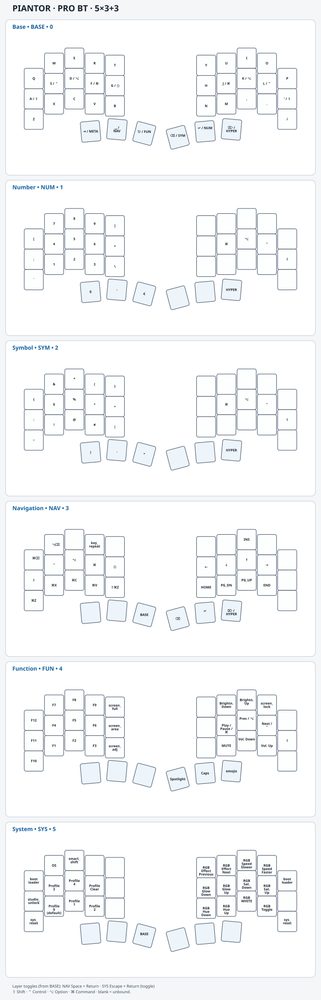

# Piantor Pro BT · 5-column keymap

Custom ZMK firmware and keymap for [Keebart's 36-key Piantor Pro BT](https://www.keebart.com/products/piantor-wireless). The layout is QWERTY-based and [Miryoku](https://github.com/manna-harbour/miryoku)-inspired.

Keymap scheme

## Keymap design

The keymap keeps letters on a conventional QWERTY base and puts frequently used modifiers on home-row holds. The approach follows [urob's timeless home-row mods](https://github.com/urob/zmk-config).

Thumb keys combine ordinary taps with layer access or modifier chords. Space, Escape, Backspace, and Return hold Navigation, Function, Symbol, and Number, respectively. Tab and Delete hold OS-aware modifier chords. From Base, Space + Return toggles Navigation and Escape + Return toggles System. NAV can be held momentarily or left active with its toggle. On NAV & SYS, the Escape thumb returns directly to Base.

| Layer      | Label | Index | Role                                                                 |
| ---------- | ----- | ----: | -------------------------------------------------------------------- |
| Base       | BASE  |     0 | QWERTY typing and home-row mods                                      |
| Number     | NUM   |     1 | Digits and number-row symbols                                        |
| Symbol     | SYM   |     2 | Punctuation and shifted symbols                                      |
| Navigation | NAV   |     3 | Editing, cursor movement, and Insert                                 |
| Function   | FUN   |     4 | F-keys, media, screenshots, Spotlight, Capslock, and Emoji & Symbols |
| System     | SYS   |     5 | OS mode, Smart Shift, Bluetooth, RGB, bootloader, and reset          |

## OS-aware behavior

The custom `os` behavior on System + W selects macOS or Windows mode. Mode is persistent per Bluetooth profile and restored when that profile becomes active. Each profile defaults to macOS.

Windows mode swaps Control and GUI/Command for ordinary keys and embedded modifiers in chords; Shift and Alt are unchanged. S/L hold Control on macOS and Windows on Windows; F/J hold Command on macOS and Control on Windows. Hold G sends Globe on macOS or Control + Windows on Windows.

These custom behaviors send explicit mode-specific chords:

| Behavior                    | Layer + key                  | macOS                      | Windows                |
| --------------------------- | ---------------------------- | -------------------------- | ---------------------- |
| `screen_full`               | FUN + T                      | Shift + Command + 3        | Windows + Print Screen |
| `screen_area`               | FUN + G                      | Shift + Command + 4        | Alt + Print Screen     |
| `screen_adj`                | FUN + B                      | Shift + Command + 5        | Windows + Shift + S    |
| `screen_lock`               | FUN + O                      | Control + Command + Q      | Windows + L            |
| `emojis`                    | FUN + Delete thumb           | Control + Command + Space  | Windows + period       |
| `meta_mt` using `meta_kp`   | BASE + Tab thumb hold        | Shift + Command            | Shift + Control        |
| `hyper_mt` using `hyper_kp` | BASE/NAV + Delete thumb hold | Control + Option + Command | Control + Alt          |
| `hyper_kp`                  | NUM/SYM + Delete thumb       | Control + Option + Command | Control + Alt          |

## State and display

**Smart Shift** toggles sentence capitalization and punctuation handling. Its enabled state persists across power cycles. **Caps Logic** taps toggle Caps Word and holds send Caps Lock. The display follows the logical Caps Word signal; its Caps Lock indication is inferred locally from key events, not read from host lock state.

The Sharp MIP display shows the active layer, modifier state, battery and connection information, and Smart Shift state. Its modifier symbols follow OS mode. The keyboard supports USB and Bluetooth, with five Bluetooth profiles and per-profile OS mode. The System layer provides profile selection, Bluetooth clear, RGB controls, bootloader entry, and reset. RGB defaults to off, turns off after five minutes idle, and the keyboard enters deep sleep after one hour. The display stays on during idle and turns off during deep sleep.

## Firmware updates

The [firmware](https://github.com/StevenKrebs/zmk-config/releases) includes left and right UF2 firmware and a settings-reset UF2 for each half.

For a normal update, connect each half by USB, put it into bootloader mode, and copy its matching left or right `.uf2` file to the mounted USB drive. The controller reboots after copying. The System layer's outermost top-row keys invoke the bootloader; the controller's reset/boot control is an alternate entry method. See the [ZMK UF2 flashing guide](https://zmk.dev/docs/user-setup) for the general bootloader process.

Settings-reset firmware clears persistent settings, including Bluetooth pairings and per-profile OS mode. To reset the split, flash the settings-reset image to both halves, then restore the normal left and right firmware. Remove the old pairing from hosts and pair again.

## Customization

For runtime remapping, the left/central firmware supports [ZMK Studio](https://zmk.studio/) over USB. Use the **Studio Unlock** binding on System, then modify supported bindings without rebuilding. Studio cannot define new behaviors. Once Studio has saved a keymap, source changes do not take effect until **Restore Stock Settings** is selected in Studio.

For source-controlled changes, use the [ZMK Keymap Editor](https://nickcoutsos.github.io/keymap-editor/).
